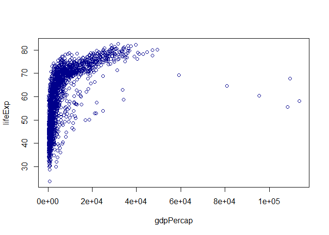
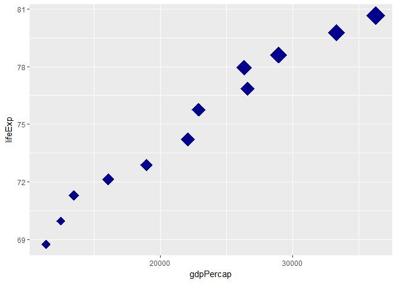
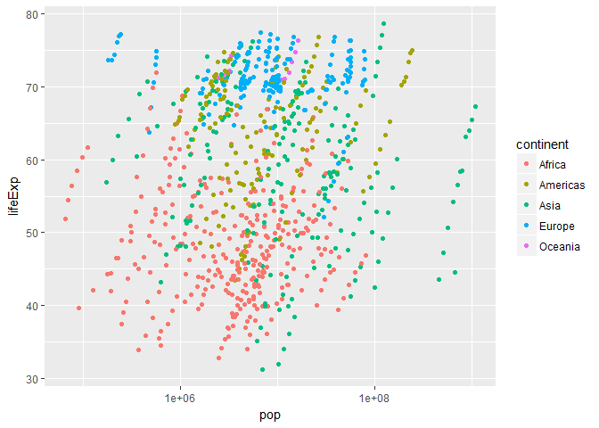

hw01\_gapminder\_RH.Rmd
================
RH
September 17, 2017

    ## Loading tidyverse: ggplot2
    ## Loading tidyverse: tibble
    ## Loading tidyverse: tidyr
    ## Loading tidyverse: readr
    ## Loading tidyverse: purrr
    ## Loading tidyverse: dplyr

    ## Conflicts with tidy packages ----------------------------------------------

    ## filter(): dplyr, stats
    ## lag():    dplyr, stats

    ## Classes 'tbl_df', 'tbl' and 'data.frame':    1704 obs. of  6 variables:
    ##  $ country  : Factor w/ 142 levels "Afghanistan",..: 1 1 1 1 1 1 1 1 1 1 ...
    ##  $ continent: Factor w/ 5 levels "Africa","Americas",..: 3 3 3 3 3 3 3 3 3 3 ...
    ##  $ year     : int  1952 1957 1962 1967 1972 1977 1982 1987 1992 1997 ...
    ##  $ lifeExp  : num  28.8 30.3 32 34 36.1 ...
    ##  $ pop      : int  8425333 9240934 10267083 11537966 13079460 14880372 12881816 13867957 16317921 22227415 ...
    ##  $ gdpPercap: num  779 821 853 836 740 ...

``` r
plot(lifeExp ~ gdpPercap, gapminder, col= "dark blue")
```



Looking at the life expectancy for Canada where population size is indicated by the size of the points

``` r
s <- round(filter(gapminder, country %in% c("Canada"))$pop/10^6.5)
p <- ggplot(filter(gapminder, country %in% c("Canada")),
            aes(x = gdpPercap, y = lifeExp))
p + geom_point(size = s, shape = 18, color = "dark blue")
```



Plotting life expectancy and population by continent shows that Europe has higher life expectancies while Africa and Asia have lower.

``` r
q <- ggplot(filter(gapminder, year %in% 1962:1990),
       aes(y = lifeExp, x = pop, color = continent)) 
q <- q + scale_x_log10()
q + geom_point(shape = 19)
```


